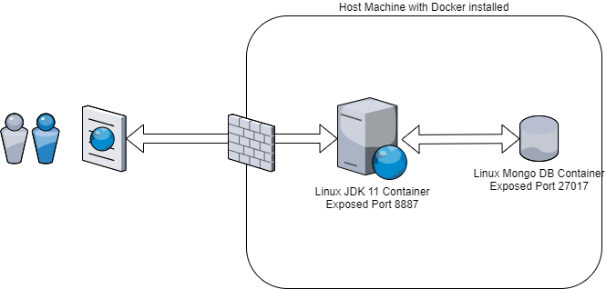

# User Management Rest API

### User Requirements

Create 2 REST services: one that allows to register a user and the other one that displays the details of a registered user.

Requirements:

- define a user (what are the fields needed). We should have mandatory and optional fields!

- validate the input and return proper error messages/http status

- log the input and output of each call and the processing time.

- have a request parameter which is not mandatory and which provides a default value in case is not set

- have a path variable

- clear code and javadoc

- unit tests

- only adults ( age > 18 years) and that live in France can create an account!

Bonuses:

- user a non-relational DB in order to save the users!

- use AOP

- documentation/UML/schemas to explain the architecture

### Technical Architecture

### Run with docker
in order to run the project using docker-compose, execute the following commands 
 - $ ./mvnw clean package
 - $ docker network create my-network
 - $ docker-compose up
 - $ curl -X 'POST' \
  'http://localhost:8887/rest/api/users' \
  -H 'accept: */*' \
  -H 'Content-Type: application/json' \
  -d '{
  "username": "john1",
  "firstName": "John",
  "lastName": "Cleese",
  "email": "john.cleese@example.com",
  "phoneNumber": "0613125565",
  "password": "MyP@ssword",
  "birthDate": "02042001",
  "country": "FR"
}'
 - $ curl -X 'GET' \
  'http://localhost:8887/rest/api/users/61081b1ee4093e44e5488523' \
  -H 'accept: application/json'
 - $ curl -X 'GET' \
  'http://localhost:8887/rest/api/users/?username=john1' \         
  -H 'accept: application/json'
  
### API Documentation
[Documentation Link](https://app.swaggerhub.com/apis-docs/aymanochko/usersmanagement/1.0.0)
